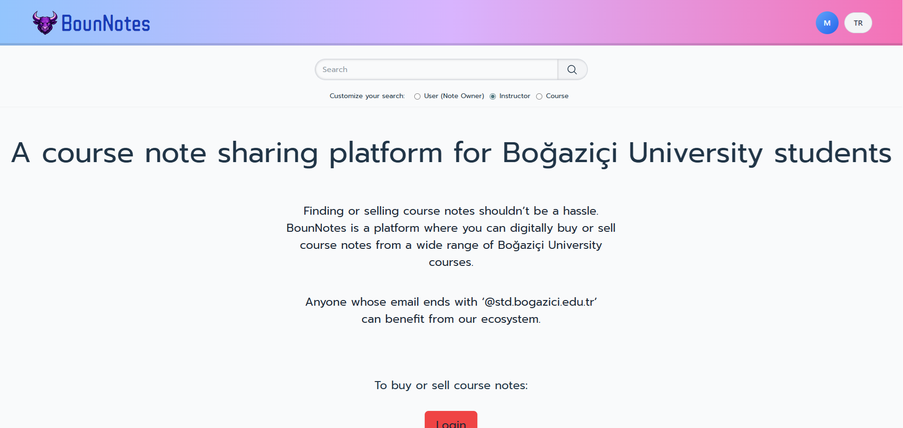
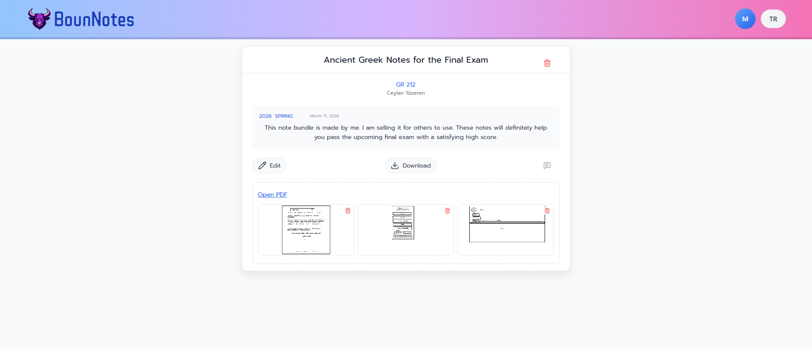
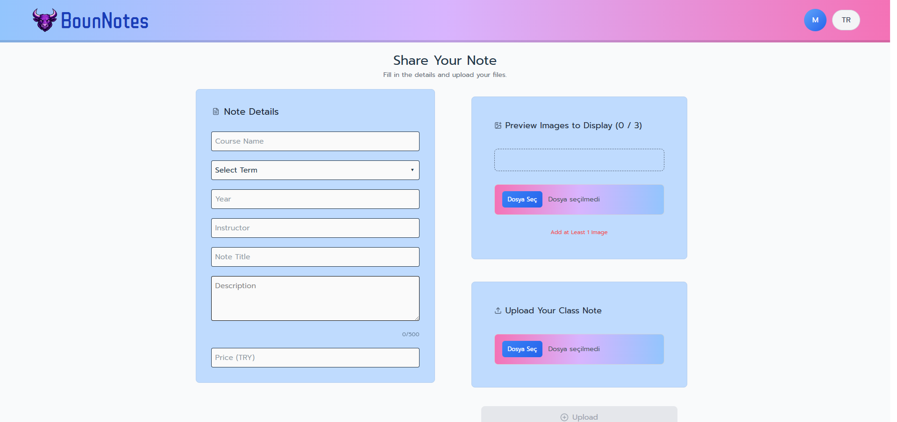
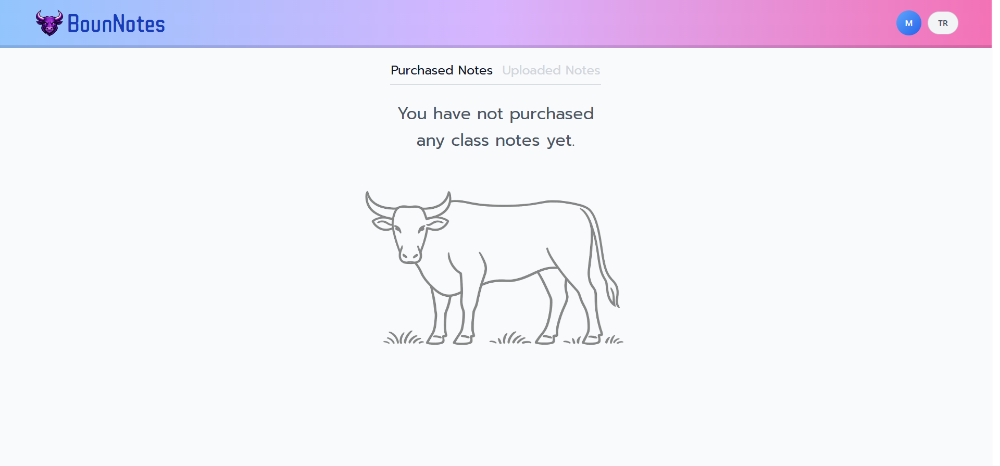
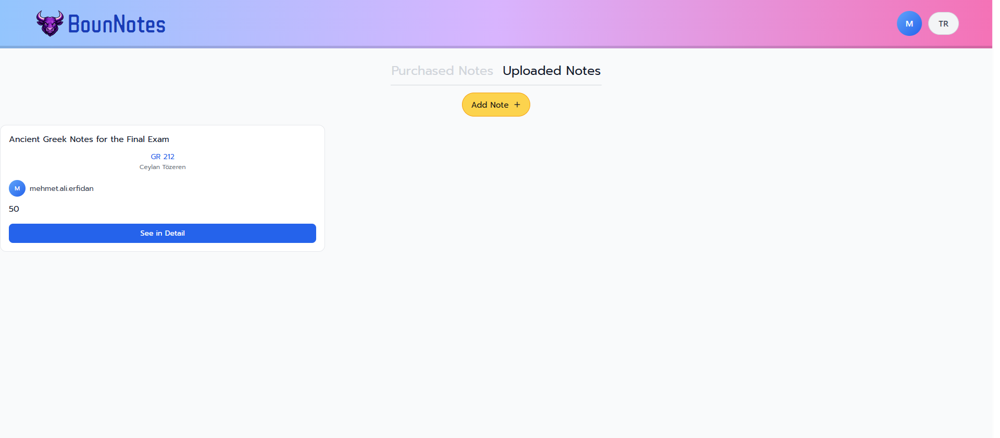
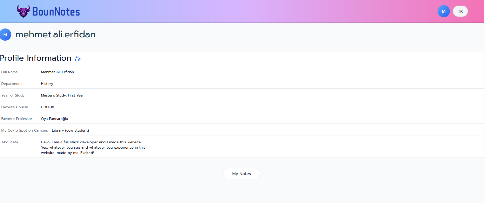

# BounNotes

BounNotes is a full-stack note sharing platform built for Boğaziçi University students.  
Users can upload lecture notes, manage assets (images/PDF), and interact through reactions and comments.

**Live Demo:** https://bounnotes.com

---

## Preview



## Features

- User authentication (JWT + email verification)
- Note upload and editing
- Image and PDF asset upload/download
- Public note pages
- Reactions and comments
- Personal dashboard (uploaded / purchased notes)
- Public user profiles
- Turkish / English UI

---

## Tech Stack

### Frontend

- React
- Vite
- TypeScript
- Redux Toolkit
- Styled Components

### Backend

- Node.js
- Express
- TypeScript

### Infrastructure

- PostgreSQL (Supabase)
- Vercel (frontend hosting)
- Render (backend hosting)

### Integrations

- Resend (email)
- Iyzico sandbox (payment infrastructure)

---

## Architecture

```text
User
  ↓
bounnotes.com (Vercel frontend)
  ↓
Node.js API (Render backend)
  ↓
PostgreSQL (Supabase)
```

---

## Screenshots

### Home


### Note Detail



### Note Upload



### Purchased Notes



### Uploaded Notes



### Profile



## Monorepo Structure

```text
src/                   → frontend application
bounnotes_backend/src/ → backend API
```

---

## Local Development

### Frontend

```bash
npm install
npm run dev
```

Runs on: `http://localhost:5173`

### Backend

```bash
cd bounnotes_backend
npm install
npm run dev
```

Runs on: `http://localhost:3001`

---

## Environment Variables

### Frontend (`/.env`)

```env
VITE_API_BASE_URL=http://localhost:3001
VITE_ALLOW_NON_BOUN_DEV_EMAILS=false
```

### Backend (`/bounnotes_backend/.env`)

Use `bounnotes_backend/.env.example` as a base.

Core variables:

- `DB_HOST`, `DB_PORT`, `DB_NAME`, `DB_USER`, `DB_PASSWORD`
- `JWT_SECRET`, `JWT_EXPIRES_IN`
- `APP_BASE_URL`, `CORS_ORIGIN`, `CORS_ORIGINS`
- `MAIL_FROM`, `RESEND_API_KEY`
- `IYZICO_API_KEY`, `IYZICO_SECRET_KEY`, `IYZICO_BASE_URL`
- `PAYMENT_SUCCESS_URL`, `PAYMENT_CANCEL_URL`
- `BACKEND_BASE_URL`

---

## Production Deployment

- Frontend -> Vercel
- Backend -> Render
- Database -> Supabase

Important notes:

- Environment variables must be set in Vercel and Render dashboards.
- Backend is built from `bounnotes_backend` root.
- Backend production start command:

```bash
npm start
```

---

## Notes

- Payment integration currently runs on Iyzico sandbox.
- This project is maintained as a portfolio and demo application.
